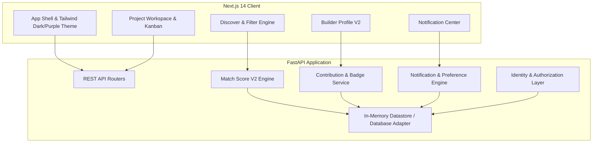

# Nexora — Find the Right People to Build and Ship With

Nexora is a web-first teammate discovery, formation, and project execution platform engineered for student builders, hackathon squads, and indie developers. It bridges the gap between searching for compatible collaborators and actually shipping together through explainable matching, verifiable contribution histories, and dedicated team workspaces.

---

## 🌟 MVP Positioning Statement

Traditional platforms stop at static builder profiles or superficial resumes. Nexora provides an end-to-end collaboration lifecycle:
1. **Discover**: Transparent, deterministic matching based on verified skills, role alignment, and availability.
2. **Form**: Two-way invitation and application lifecycles with role slot capacity enforcement.
3. **Execute**: Private project workspaces with Kanban boards, milestones, and audit trails.
4. **Attest**: Evidence-based builder reputations derived from completed tasks and project lifecycles—with zero black-box AI scores or arbitrary points.

---

## 🏗️ Architecture Overview



### Technology Stack
- **Frontend**: Next.js 14 (App Router), React 18, TypeScript, Tailwind CSS, Lucide React icons.
- **Backend**: FastAPI, Python 3.11+, Pydantic V2, Uvicorn, Pytest.
- **Data & State**: Pluggable storage architecture with deterministic in-memory seedable development database.
- **Matching Engine**: Explainable, deterministic Match Score V2 with mathematical cold-start neutrality.

---

## ⚡ Core Feature Modules (Phases 1–8)

### 1. Evidence-Based Builder Profiles V2 (Phase 7)
- **Contribution History**: Displays completed projects, role-specific history, verified tasks, and non-noise activity feeds.
- **Deterministic Badges**: Awards badges purely based on verifiable milestones (`first_project`, `contributor`, `active_contributor`, `project_finisher`, `multi_project`, `consistent_contributor`).
- **Cold-Start Safe**: New builders receive welcoming neutral baselines instead of empty walls of zeros.

### 2. Match Score V2 & Discovery Intelligence (Phase 8)
- **Skill Overlap (45%)**: Canonicalizes and compares required skills against builder toolsets.
- **Role Alignment & Experience (20%)**: Checks declared preferred roles and verified past role delivery.
- **Availability Match (15%)**: Evaluates hackathon vs. side-project intent and applies busy penalties.
- **Contribution Reliability (10%)**: Analyzes verified task completion rates (neutral 100% for cold-start users).
- **Project Experience (10%)**: Recognizes full project lifecycles completed on Nexora.
- **Explainable Reasons & Missing Requirements**: Surfaces actionable bullet explanations and skill gap tags.

### 3. Team Formation & Request Lifecycle (Phase 4)
- **Teammate Invitations**: Leads can invite specific builders to projects or open roles (`pending`, `accepted`, `declined`, `cancelled`).
- **Role Capacity**: Automatically tracks open vs. filled role slots; closes roles upon full capacity.
- **Reciprocal Synchronization**: Accepting an invitation automatically resolves pending applications for that user on that project.

### 4. Team Workspace & Project Execution (Phase 5)
- **Private Project Workspace**: Secure route (`/projects/[id]/workspace`) protected by backend authorization.
- **Collaborative Kanban Board**: Multi-status task management (`todo`, `in_progress`, `done`) with assignee attribution, milestone linkage, and priority flags.
- **Milestone Tracking**: Chronological milestones with active progress bars and deadline indicators.
- **Activity Feed**: Audit trail tracking project status updates, task completions, and team roster changes.

### 5. Notification Center & Preferences (Phase 6)
- **In-App Notification Hub**: Real-time collated inbox for team invites, applications, task assignments, and milestone updates.
- **Category Filters**: Instant triage across `Team`, `Tasks`, `Milestones`, and `Projects`.
- **Granular Notification Preferences**: Configurable toggles per notification category.

---

## 🚀 Local Setup & Quick Start

### 1. Backend Setup

```bash
cd backend
python -m venv .venv
source .venv/bin/activate
pip install -r requirements.txt
cp .env.example .env
uvicorn main:app --reload --port 8000
```

Verify backend health:
```bash
curl http://localhost:8000/health
# {"status":"ok","timestamp":"...","storage_type":"in_memory"}
```

### 2. Frontend Setup

```bash
cd frontend
npm install
cp .env.example .env.local
npm run dev
```

Open `http://localhost:3000` in your browser. The application runs in full local demo mode with pre-seeded student builders, projects, and collaboration histories.

---

## 🧪 Verification & QA Commands

Run the full automated test and verification suite:

```bash
# 1. Backend Pytest Suite (139 tests)
cd backend
PYTHONPATH=. .venv/bin/pytest -v

# 2. Frontend Type Check
cd ../frontend
npx tsc --noEmit

# 3. Frontend Lint
npm run lint

# 4. Frontend Production Build
npm run build
```

---

## 🎬 End-to-End Demo Script

Follow this guided script to explore the complete Nexora workflow in under 3 minutes:

1. **Explore Discover**:
   - Navigate to `/discover`.
   - Toggle between **Recommended Roles** and **All Builders**.
   - Review the **Deterministic Match Score V2** badge and expand it to inspect the 5 weighted dimensions and explanation bullets.
2. **View Builder Profile V2**:
   - Click on any builder card (e.g., `/profile/bob` or `/profile/charlie`).
   - Observe the **Contribution Summary**, **Verified Badges**, **Project Lifecycles**, and **Recent Activity**.
3. **Invite Builder to Role**:
   - Click **Invite / Connect** on the profile.
   - Select your project and choose an open role.
   - Observe the live Match Score preview before sending the invite.
4. **Review Team Workspace**:
   - Navigate to `/projects/proj-1/workspace`.
   - Drag or update tasks across **To Do**, **In Progress**, and **Done**.
   - Check the **Project Progress Bar** recalculating in real-time.
5. **Check Notifications**:
   - Click the bell icon in the navigation bar (`/notifications`).
   - Filter notifications by category or mark all as read.
6. **Edit Your Builder Profile**:
   - Head to `/profile/edit` to update technical skills, preferred roles, and availability status.

---

## 📡 API Route Reference

| Method | Endpoint | Description | Authorization |
| :--- | :--- | :--- | :--- |
| `GET` | `/api/users/me` | Current user profile & stats | Required |
| `PATCH`| `/api/users/me` | Update current profile & skills | Required |
| `GET` | `/api/users/{id}/contributions` | Builder Profile V2 & badges | Public |
| `GET` | `/api/projects` | List public recruiting projects | Public |
| `POST`| `/api/projects` | Create new project with roles | Required |
| `GET` | `/api/projects/{id}/workspace/tasks` | Workspace Kanban tasks | Squad Members Only |
| `POST`| `/api/projects/{id}/workspace/tasks` | Create task with assignment | Squad Members Only |
| `PATCH`| `/api/projects/{id}/workspace/tasks/{tid}` | Move/update task status | Squad Members Only |
| `POST`| `/api/projects/{id}/apply` | Apply to open project role | Required |
| `POST`| `/api/requests` | Send teammate / role invitation | Required |
| `POST`| `/api/requests/{id}/respond` | Accept / decline invitation | Recipient Only |
| `GET` | `/api/matches/me/roles` | Match Score V2 role suggestions | Required |
| `GET` | `/api/matches/users/{uid}/roles/{rid}` | Match Score V2 role breakdown | Public / Owner |
| `GET` | `/api/notifications` | User in-app notifications | Required |

---

## 🔒 Security & Quality Assurance

- **Zero IDOR Vulnerabilities**: All project mutations, workspace accesses, application decisions, and invitation actions strictly enforce user identity and squad membership at the API layer.
- **Strict Input Validation**: Handled through Pydantic V2 with length bounds, string sanitization, and literal enums.
- **Accessible & Responsive**: Fully verified across mobile (390×844), tablet (768×1024), and desktop (1440×900) viewports with zero horizontal overflow, ARIA dialog semantics, focus management, and keyboard accessibility.
