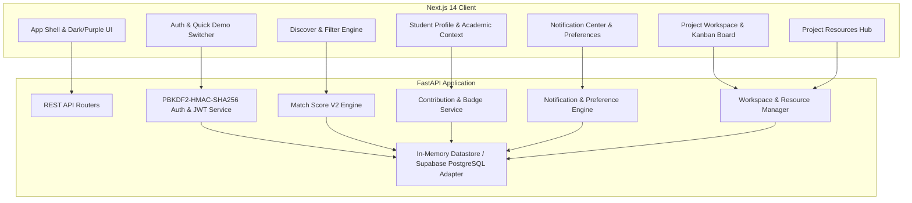

# Nexora — Find the Right People to Build and Ship With

Nexora is a web-first teammate discovery, formation, and project collaboration platform engineered for student builders, hackathon squads, and indie developers. It bridges the gap between searching for compatible collaborators and actually shipping together through explainable matching, verifiable contribution histories, dedicated team workspaces, and shared project resource hubs.

---

## 🌟 Core Value Proposition

Traditional platforms stop at static builder profiles or superficial resumes. Nexora provides an end-to-end collaboration lifecycle:
1. **Discover**: Transparent, deterministic matching (Match Score V2) based on verified skills, role alignment, academic focus, and availability.
2. **Form**: Two-way invitation and application lifecycles with strict role slot capacity enforcement.
3. **Execute**: Private project workspaces with Kanban boards, milestones, shared resource hubs (GitHub, Figma, Docs), and audit trails.
4. **Attest**: Evidence-based builder reputations derived from completed tasks and project lifecycles—with zero black-box AI scores or arbitrary points.

---

## 🏗️ Architecture Overview



### Technology Stack
- **Frontend**: Next.js 14 (App Router), React 18, TypeScript, Tailwind CSS, Lucide React icons.
- **Backend**: FastAPI, Python 3.13+, Pydantic V2, Uvicorn, Pytest.
- **Security**: PBKDF2-HMAC-SHA256 password hashing (100,000 rounds), HMAC-SHA256 JWT tokens.
- **Data & State**: Pluggable storage architecture (in-memory development database + Supabase PostgreSQL schema with RLS).
- **Matching Engine**: Explainable, deterministic Match Score V2 with mathematical cold-start neutrality.

---

## ⚡ Core Feature Modules

### 1. Real Authentication & Academic Builder Profiles
- **Secure Authentication**: Production-grade PBKDF2-HMAC-SHA256 salted password hashing and HS256 JWT session tokens.
- **Academic & Developer Context**: Student profiles include College, Department, Graduation Year, Portfolio URL, and Experience Level (`beginner`, `intermediate`, `advanced`).
- **Quick Demo Builder Switcher**: 1-click account switching between pre-seeded personas (Alice the Founder, Bob the Frontend Engineer, Charlie the ML Lead) for immediate interactive evaluation.

### 2. Match Score V2 & Teammate Discovery
- **Deterministic 5-Factor Scoring (0–100%)**:
  - Skill Overlap (45%): Canonicalized skill comparison against role requirements.
  - Role Alignment & Experience (20%): Declared interests + verified delivery.
  - Availability & Bandwidth (15%): Open vs. busy status with workload penalty.
  - Task Delivery Reliability (10%): Ratio of completed assigned tasks (neutral 100% for cold-start users).
  - Project Completion Track Record (10%): Number of successfully shipped projects.
- **Explainable Reasoning**: Bulleted explanations detailing exact matches and missing requirements.

### 3. Team Formation & Role Capacity Enforcement
- **Teammate Invitations**: Leads can invite specific builders to projects or open roles (`pending`, `accepted`, `declined`, `cancelled`).
- **Open Role Capacity**: Tracks available vs. filled role slots (`slots` and `filled_slots`); automatically transitions role to `filled` once capacity is reached.
- **Reciprocal Synchronization**: Accepting an invitation automatically resolves pending applications for that user on that project.

### 4. Team Workspace & Project Execution
- **Private Project Workspace**: Secure route (`/projects/[id]/workspace`) protected by backend membership authorization.
- **Collaborative Kanban Board**: Multi-status task management (`todo`, `in_progress`, `done`) with assignee attribution, milestone linkage, and priority flags.
- **Milestone Tracking**: Chronological milestones with active progress bars and deadline indicators.
- **Project Resources Hub**: Central repository of GitHub links, Figma prototypes, documentation, and live deployments with category-specific badges.
- **Activity Feed**: Audit trail tracking project status updates, task completions, and team roster changes.

### 5. Notification Center & Preferences
- **In-App Notification Hub**: Real-time collated inbox for team invites, applications, task assignments, and milestone updates.
- **Category Filters**: Instant triage across `Team`, `Tasks`, `Milestones`, and `Projects`.
- **Granular Preferences**: Configurable toggles per notification category.

---

## 🚀 Local Setup & Quick Start

### 1. Backend Setup

```bash
cd backend
python3 -m venv .venv
source .venv/bin/activate
pip install -r requirements.txt
cp .env.example .env
uvicorn main:app --reload --port 8000
```

Verify backend health:
```bash
curl http://localhost:8000/health
# {"status":"ok","timestamp":"...","storage_type":"in_memory"}
```

### 2. Frontend Setup

```bash
cd frontend
npm install
cp .env.example .env.local
npm run dev
```

Open `http://localhost:3000` in your browser. The application includes real authentication alongside pre-seeded student builders, projects, and collaboration histories.

---

## 🧪 Verification & Quality Gates

All automated quality gates have passed with 100% success:

```bash
# 1. Backend Pytest Suite (149 tests)
cd backend
PYTHONPATH=. .venv/bin/pytest -v

# 2. Frontend Type Check (0 errors)
cd ../frontend
npx tsc --noEmit

# 3. Frontend Lint (0 warnings)
npm run lint

# 4. Frontend Production Build (16/16 routes)
npm run build
```

---

## 📡 API Route Reference

| Method | Endpoint | Description | Authorization |
| :--- | :--- | :--- | :--- |
| `POST` | `/api/auth/register` | Register new student builder | Public |
| `POST` | `/api/auth/login` | Authenticate builder & issue JWT | Public |
| `GET` | `/api/auth/me` | Fetch authenticated builder profile | Required |
| `GET` | `/api/auth/demo-users` | List 1-click quick demo builder profiles | Public |
| `GET` | `/api/users/me` | Current user profile & stats | Required |
| `PATCH`| `/api/users/me` | Update current profile, academic info & skills | Required |
| `GET` | `/api/users/{id}/contributions` | Builder Profile V2 & badges | Public |
| `GET` | `/api/projects` | List public recruiting projects | Public |
| `POST`| `/api/projects` | Create new project with roles | Required |
| `GET` | `/api/projects/{id}/workspace` | Workspace overview & metrics | Squad Members Only |
| `GET` | `/api/projects/{id}/tasks` | Workspace Kanban tasks | Squad Members Only |
| `POST`| `/api/projects/{id}/tasks` | Create task with assignment | Squad Members Only |
| `PATCH`| `/api/projects/{id}/tasks/{tid}` | Move/update task status | Squad Members Only |
| `GET` | `/api/projects/{id}/resources` | List project shared resources | Squad Members Only |
| `POST`| `/api/projects/{id}/resources` | Add project resource (GitHub, Figma, etc.) | Squad Members Only |
| `DELETE`| `/api/projects/{id}/resources/{rid}` | Delete project resource | Creator or Owner |
| `POST`| `/api/projects/{id}/apply` | Apply to open project role | Required |
| `POST`| `/api/requests` | Send teammate / role invitation | Project Owner Only |
| `POST`| `/api/requests/{id}/respond` | Accept / decline invitation | Recipient Only |
| `GET` | `/api/matches/me/roles` | Match Score V2 role suggestions | Required |
| `GET` | `/api/matches/users/{uid}/roles/{rid}` | Match Score V2 role breakdown | Public / Owner |
| `GET` | `/api/notifications` | User in-app notifications | Required |

---

## 🔒 Security Guarantees

- **Zero IDOR Vulnerabilities**: All project mutations, workspace accesses, application decisions, and invitation actions strictly enforce user identity and squad membership at the API layer.
- **Salted Password Storage**: Standard-library PBKDF2-HMAC-SHA256 with 100,000 iterations and per-credential random salt.
- **Strict Input Validation**: Handled through Pydantic V2 with length bounds, string sanitization, and literal enums.
- **Accessible & Responsive**: Fully verified across mobile (390×844), tablet (768×1024), and desktop (1440×900) viewports with zero horizontal overflow, ARIA dialog semantics, focus management, and keyboard accessibility.

---

## 📚 Project Documentation

Comprehensive engineering documentation is maintained in the `docs/` directory:

- [Product Requirements Document](docs/PRD.md)
- [System Architecture & Threat Model](docs/ARCHITECTURE.md)
- [Implementation Plan & Execution Records](docs/IMPLEMENTATION_PLAN.md)
- [Current System Status](docs/STATUS.md)
- [Architectural Decision Records](docs/DECISIONS.md)
- [Testing & Verification Guide](docs/TESTING.md)

---

## 📄 License

This project is open-source under the [MIT License](LICENSE).

