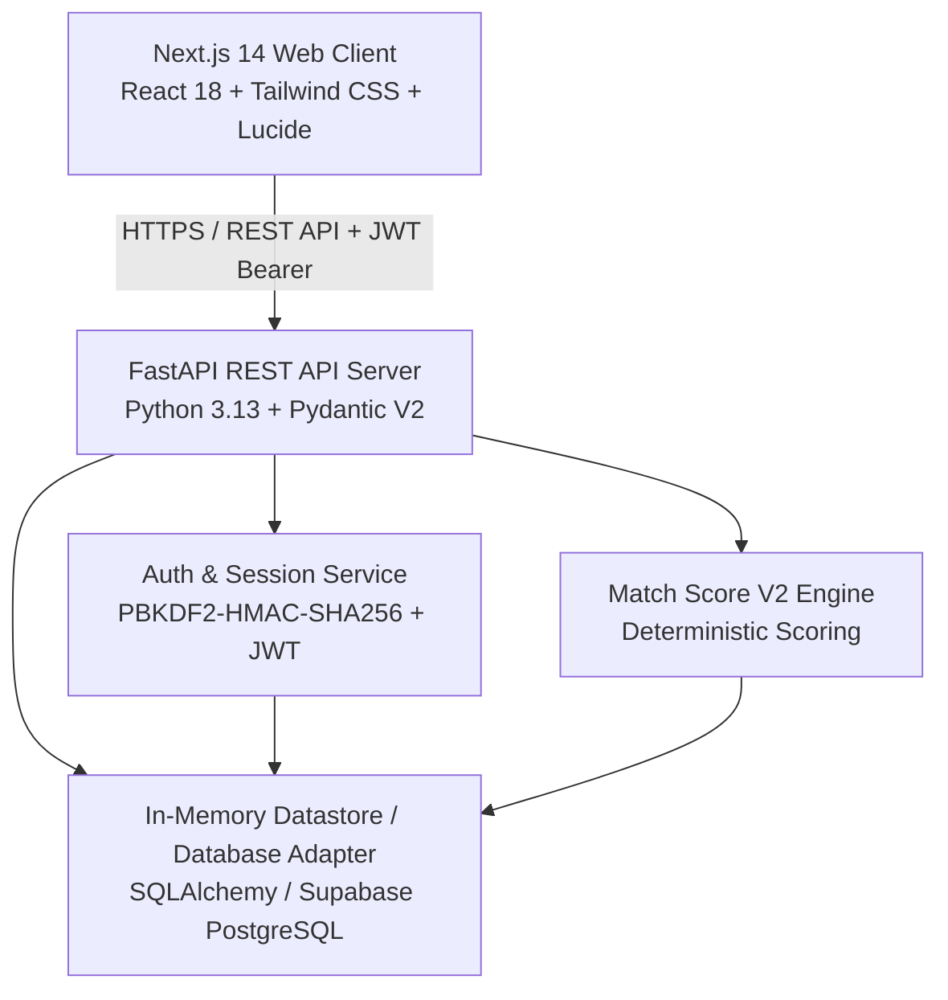
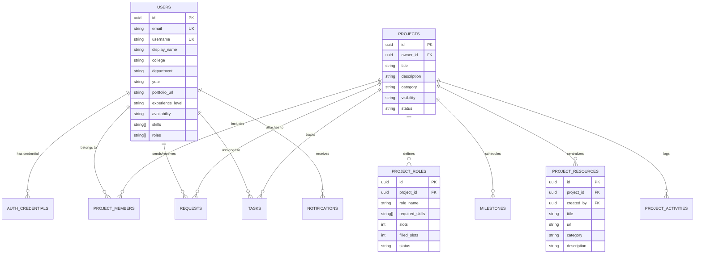

# Nexora — Architecture & Technical Specifications

## 1. System Topology



---

## 2. Directory Structure

```
Nexora/
├── backend/
│   ├── app/
│   │   ├── api/
│   │   │   ├── routes/
│   │   │   │   ├── auth.py              # Register, login, me, logout, demo-users
│   │   │   │   ├── users.py             # User profile, discovery, academic fields
│   │   │   │   ├── projects.py          # Project CRUD, roles, apply, members
│   │   │   │   ├── requests.py          # Invitations and applications lifecycle
│   │   │   │   ├── workspace.py         # Kanban tasks, milestones, activity, overview
│   │   │   │   ├── resources.py         # Project resources (GitHub, Figma, docs)
│   │   │   │   ├── matches.py           # Match Score V2 recommendations & breakdown
│   │   │   │   ├── contributions.py     # Builder badges & verified contribution history
│   │   │   │   └── notifications.py     # Notifications hub & category preferences
│   │   ├── core/
│   │   │   ├── auth.py                  # PBKDF2 hashing, JWT signing and verification
│   │   │   ├── identity.py              # Authorization dependencies & token extraction
│   │   │   ├── database.py              # In-memory mock database & seed datasets
│   │   │   ├── notifications.py         # Notification dispatcher & rule handlers
│   │   │   └── config.py                # Pydantic environment settings
│   │   ├── models/
│   │   │   ├── orm.py                   # SQLAlchemy models (User, Credential, Project, etc.)
│   │   │   ├── auth.py                  # Auth request & response schemas
│   │   │   ├── user.py                  # User profile & update schemas
│   │   │   ├── project.py               # Project, Role, and Member schemas
│   │   │   ├── request.py               # Invitation & Application schemas
│   │   │   ├── workspace.py             # Task, Milestone, Overview schemas
│   │   │   ├── resource.py              # Project resource schemas
│   │   │   ├── match.py                 # Match Score V2 schemas
│   │   │   ├── contribution.py          # Badge and contribution history schemas
│   │   │   └── notification.py          # Notification schemas
│   │   └── services/
│   │       ├── matching.py              # Match Score V2 computation algorithm
│   │       └── contribution.py          # Badge evaluation & stats service
│   ├── tests/                           # 148 automated unit, integration & E2E tests
│   ├── main.py                          # FastAPI application initialization & route mounting
│   └── requirements.txt
├── frontend/
│   ├── src/
│   │   ├── app/
│   │   │   ├── (auth)/login/page.tsx    # Builder login & demo account switcher
│   │   │   ├── (auth)/signup/page.tsx   # Builder registration with academic fields
│   │   │   ├── logout/page.tsx          # Session termination & redirect
│   │   │   ├── discover/page.tsx        # Teammate & role discovery with Match Score V2
│   │   │   ├── profile/                 # Current & public builder profiles with badges
│   │   │   ├── projects/                # Project listings, detail, creation
│   │   │   │   └── [id]/workspace/      # Private workspace (Kanban, Milestones, Resources)
│   │   │   ├── requests/page.tsx        # Inbound/outbound invitations & applications
│   │   │   ├── notifications/page.tsx   # Notification center & preference drawer
│   │   │   └── layout.tsx               # Root layout wrapped in AuthProvider
│   │   ├── components/
│   │   │   ├── AppShell.tsx             # Responsive layout shell
│   │   │   ├── Sidebar.tsx              # Navigation & active user popover
│   │   │   ├── MatchScoreBadge.tsx      # Match breakdown visualizer
│   │   │   ├── Toast.tsx                # Toast notification system
│   │   │   └── ui/Dialog.tsx            # Accessible modal dialog component
│   │   └── lib/
│   │       ├── api.ts                   # Fetch API client with automatic JWT bearer injector
│   │       ├── auth.tsx                 # React Context AuthProvider & useAuth hook
│   │       └── types.ts                 # Full TypeScript definitions matching backend schemas
│   └── package.json
└── docs/                                # Project memory, PRD, architecture, decisions, test plan
```

---

## 3. Data Model & Relationships



---

## 4. Security Architecture & Threat Model

1. **Password Security**:
   - Algorithms: PBKDF2-HMAC-SHA256 with 100,000 iterations and 16-byte cryptographically secure random salt (`secrets.token_hex(16)`).
   - Storage: Formatted as `pbkdf2:sha256:100000$<salt>$<hash>`. Constant-time comparison (`hmac.compare_digest`) prevents timing attacks.
2. **Session / Token Security**:
   - Signed JSON Web Tokens (JWT) using HMAC-SHA256 (`HS256`).
   - Server-enforced signature verification, subject claim extraction, and expiration verification.
   - Dual-mode header handling: Extracts Bearer tokens seamlessly for both real JWTs and legacy development mocks.
3. **Authorization & IDOR Protection**:
   - Zero Trust mutation endpoints: Project mutations verify `project["owner_id"] == current_user_id`.
   - Workspace access: Endpoint gates verify membership (`current_user_id in [m.user_id for m in members] or is_owner`).
   - Request resolution: Recipient-only enforcement on invitations; owner-only enforcement on applications.
4. **Data Validation**:
   - Pydantic V2 schemas with strictly bounded strings, regex-validated usernames (`^[a-zA-Z0-9_]{3,30}$`), and URL formats.
